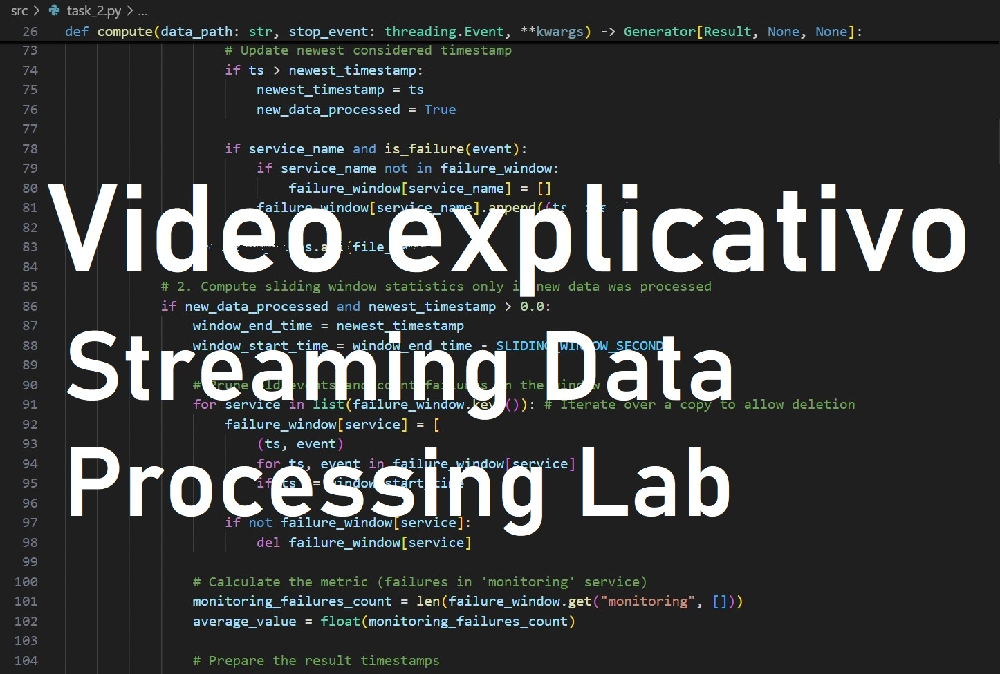

# Streaming Data Processing Lab
> Realizado por: Manuela Ramos Ospina, Paula Andrea Pirela Rios y Carlos Eduardo Baez Coronado

# Video explicativo
[](https://www.youtube.com/watch?v=9TGhIqmpdgo)

Este proyecto implementa diferentes enfoques para procesar flujos de datos (streams) en tiempo real, simulando un sistema que recibe logs de múltiples microservicios.
Cada tarea implementa una técnica distinta de análisis incremental o probabilístico sobre datos en continuo crecimiento.

## Estructura del Repositorio

```
├── data/                    # Carpeta donde se almacenan los datos JSON de entrada
│
├── scripts/
│   └── generator.py         # Generador de archivos JSON simulando streams de logs
│
├── src/                     # Código fuente principal
│   ├── __init__.py
│   ├── domain.py            # Definición de entidades y lógica compartida
│   ├── main.py              # Script principal para ejecutar las tareas
│   ├── task_1.py            # Tarea 1: Promedios acumulados (Running Averages)
│   ├── task_2.py            # Tarea 2: Ventanas deslizantes (Sliding Windows)
│   ├── task_3.py            # Tarea 3: Muestreo aleatorio (Reservoir Sampling)
│   ├── task_4.py            # Tarea 4: Filtro de Bloom (Bloom Filter)
│   ├── task_5/              # Tarea 5: Implementación con Polars
│   └── task_6/              # Tarea 6: Implementación con Spark Streaming
│
├── tests/                   # Pruebas unitarias para cada tarea
│   ├── __init__.py
│   ├── test_task_1.py
│   ├── test_task_2.py
│   ├── test_task_3.py
│   └── test_task_4.py
│
├── compose.yml              # Configuración para ejecución en contenedores
├── Dockerfile               # Imagen base del proyecto
├── script.Dockerfile        # Imagen secundaria para generación o pruebas
├── requirements.txt         # Dependencias y configuración del proyecto
├── uv.lock                  # Archivo de bloqueo de dependencias
└── README.md                # Este archivo
```
## Resumen de Tareas
| Tarea | Descripción                                                                                  | Archivo fuente  | Prueba unitaria        |
| :---- | :------------------------------------------------------------------------------------------- | :-------------- | :--------------------- |
| **1** | Cálculo incremental del promedio de peticiones exitosas por servicio.                        | `src/task_1.py` | `tests/test_task_1.py` |
| **2** | Cómputo de la tasa de errores en ventanas deslizantes de 1 minuto.                           | `src/task_2.py` | `tests/test_task_2.py` |
| **3** | Implementación del algoritmo *Reservoir Sampling* para identificar el código HTTP más común. El algoritmo de Reservoir Sampling garantiza que cada elemento del stream tenga la misma probabilidad de estar en el reservorio, incluso cuando no conocemos el tamaño total del stream de antemano. | `src/task_3.py` | `tests/test_task_3.py` |
| **4** | Implementación de un *Bloom Filter* para filtrar mensajes de interés en flujos masivos.      | `src/task_4.py` | `tests/test_task_4.py` |

## Instrucciones de ejecución
1. Crear entorno virtual e instalar dependencias:
   ```bash
   python -m venv venv
   source venv/bin/activate  # En Windows: venv\Scripts\activate
   pip install -r requirements.txt
   ```
2. Generar datos de prueba:
   ```bash
   python scripts/generator.py --output_dir data/ --num_files 10 --events_per_file 1000
   ```
3. Ejecutar las tareas:

### Tarea 1
   ```bash
   python src/main.py --task task_1 --source data/
   ```

### Tarea 2
   ```bash
   python src/main.py --task task_2 --source data/
   ```

### Tarea 3
   ```bash
   python -m src.main --source data --task task_3 --config .\src\config\config_task_3.json
   ```

### Tarea 4
   ```bash
   python -m src.main --source data --task task_4 --config .\src\config\config_task_4.json
   ```

## Pruebas unitarias
Cada tarea incluye su propio módulo de test.
Ejecuta todos los tests con:
```bash
pytest -v
```
O para una tarea especifica:
```bash
python -m pytest tests/test_task_1.py -v
```

### Explicación de los test por tarea:

#### Test 1 - Running Averages
- **test_streaming_log_aggregator**: Valida el cálculo incremental de la tasa de éxito (peticiones 2xx) procesando dos batches secuenciales. Verifica que el promedio acumulado se actualiza correctamente (50% con 1/2 éxitos → 66.7% con 2/3 éxitos) y que las marcas de tiempo reflejan la ventana completa procesada.

#### Test 2 - Sliding Windows
- **test_task_2_sliding_window**: Verifica el conteo de fallas (4xx, 5xx) en ventanas deslizantes de 60 segundos. Procesa tres batches validando que: (1) eventos fuera de ventana se descartan correctamente, (2) el contador se actualiza al agregar nuevas fallas, (3) los límites temporales de la ventana se calculan correctamente (T-60, T).

#### Test 3 - Reservoir Sampling
- **test_reservoir_sampling_basic**: Verifica funcionamiento básico con distribución equitativa
- **test_reservoir_sampling_majority**: Identifica correctamente el código HTTP más común (80% de 200s vs 20% de 500s)
- **test_reservoir_sampling_probability**: Mantiene probabilidades uniformes en 50 iteraciones
- **test_reservoir_with_multiple_codes**: Funciona con múltiples códigos de estado (200, 500, 404, 503)
- **test_reservoir_size_respected**: Respeta el parámetro reservoir_size configurado
- **test_empty_source**: Maneja correctamente directorios vacíos y procesa datos al agregarlos

**Verificaciones**: Correctitud del algoritmo, tamaño del reservorio, probabilidad uniforme, manejo de múltiples códigos, robustez ante casos edge, detección del más común.

#### Test 4 - Bloom Filter
- **test_task_4_bloom**: Valida el filtrado probabilístico de mensajes usando un Bloom Filter (1024 bytes, 3 funciones hash). Verifica que el filtro identifica correctamente mensajes de interés ("HTTP Status Code: 500") y calcula la proporción de matches (50% cuando 1 de 2 eventos coincide con los patrones configurados).

---
# Detalle de cada tarea

## Task 1

**Introducción y Formato de Datos**
El sistema procesa logs de microservicios. Cada log es un evento que contiene el nombre del servicio, la marca de tiempo de su ocurrencia y un mensaje que describe el evento.

La información de los logs está estandarizada para reportar códigos de estado HTTP bajo el formato: HTTP Status Code: XXX. Esto facilita la comparación del rendimiento y la identificación de errores entre diferentes servicios.

La fuente de datos es un directorio que almacena archivos JSON. Cada objeto JSON dentro de estos archivos representa un evento de log con los campos mencionados.

**Promedios Móviles (Running Averages):**

Esta técnica permite calcular estadísticas de un conjunto de datos en crecimiento sin re-procesar todo el histórico. El promedio $\bar{x}_t$ se calcula en cualquier punto $t$ como la suma acumulada de los elementos $\sum x_i$ dividida por el número de elementos $n_t$ hasta ese momento.Implementación requerida: Desarrollar un algoritmo para calcular de forma continua el número promedio de peticiones exitosas por servicio. Se debe definir claramente qué códigos de estado HTTP (p. ej., rango 2xx) se consideran un éxito.

## Task 2: Tareas de Procesamiento de Datos Streaming

El sistema está diseñado para implementar ventanas deslizantes sobre flujos de datos continuos. Las ventanas deslizantes son cruciales para calcular métricas que solo son relevantes en un período de tiempo reciente y fijo. Se mantiene en memoria el conjunto de registros que caen dentro del período de la ventana.

Se requiere desarrollar un algoritmo de ventana deslizante para calcular la tasa de peticiones fallidas durante el último minuto. La tasa de fallos se define como la proporción de peticiones que resultaron en un código de error (típicamente 4xx o 5xx) respecto al total de peticiones en ese intervalo de 60 segundos.

## Task 3: Muestreo (Sampling)

Ante un volumen de datos que no puede ser manejado en su totalidad, se requiere una técnica de muestreo que garantice la representatividad de la muestra en un contexto de flujo de datos (donde el tamaño total es desconocido). Se requiere implementar el algoritmo de Muestreo de Depósito (Reservoir Sampling) para determinar el código de estado HTTP más común en el conjunto de datos hasta el momento. Este algoritmo asegura que, en cualquier punto, cada elemento visto tiene la misma probabilidad de ser incluido en la muestra final.


## Task 4: Filtrado (Filtering)

Para identificar y aislar eficientemente mensajes de log de interés especial, se necesita una técnica que maneje listas de mensajes grandes sin ocupar demasiada memoria. Se requiere utilizar el Filtro de Bloom (Bloom Filter) para decidir si un mensaje de log debería ser reenviado a otro sistema. El Filtro de Bloom se utiliza para realizar una comprobación probabilística y eficiente de la pertenencia de un mensaje a una lista predefinida de mensajes de interés que no cabe en la memoria.

## Task 5: Streaming con Polars

Polars facilita el manejo de datos de streaming a través de su interfaz LazyFrame, optimizando las consultas y permitiendo el procesamiento "fuera de memoria".

Se propone calcular la tasa de éxito por servicio utilizando la capacidad de streaming de Polars para procesar grandes volúmenes de logs de manera eficiente. Esta estadística es crucial para monitorear el rendimiento individual de cada microservicio en el flujo continuo de datos.

**Resultados obtenidos:**
El script procesó 122 archivos JSON con 12,200 eventos y calculó la tasa de éxito por servicio con los siguientes resultados:

- evaluation: 36.3% de éxito

- inference: 34.9% de éxito

- monitoring: 36.5% de éxito

- training: 36.5% de éxito

El script está listo para ejecutarse tanto localmente como en EC2 con los datos descargados desde S3.

## Task 6: Streaming con Spark Streaming

Apache Spark Structured Streaming es un motor robusto para el procesamiento de datos de streaming que trata los flujos de datos como tablas en continuo crecimiento. Se requiere proponer un conjunto de estadísticas que se puedan calcular de manera ventajosa utilizando la API de Spark Structured Streaming. Se debe explicar por qué las estadísticas elegidas son particularmente adecuadas para el marco de Spark (por ejemplo, agregaciones con estado, uniones de streams o detección de anomalías en tiempo real).
